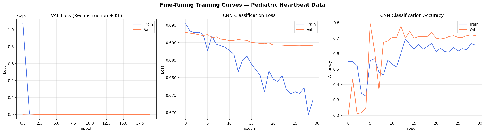
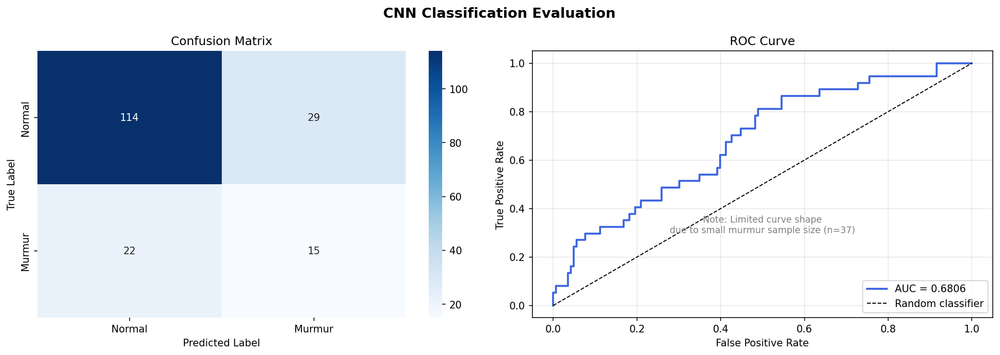
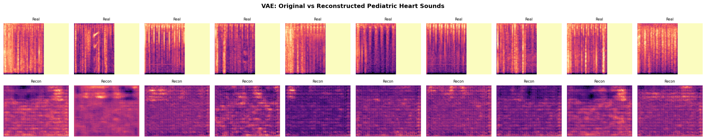
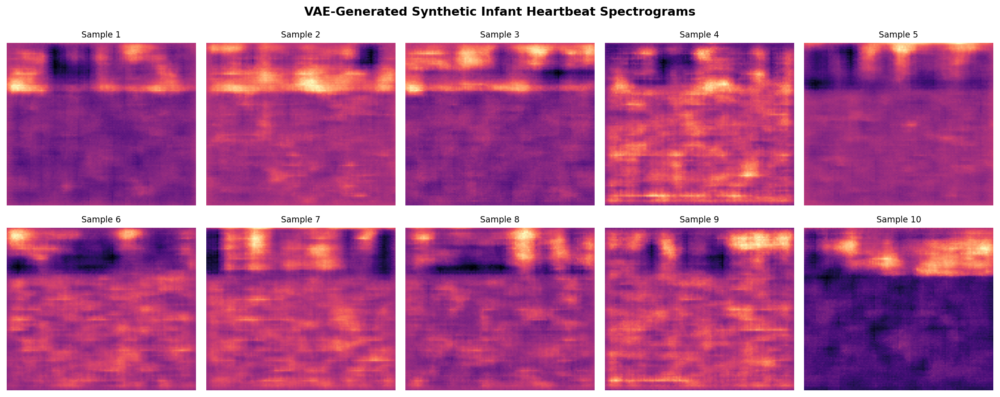
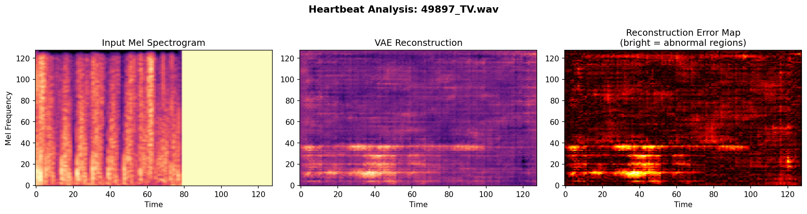

# Generative AI-Based Infant Heartbeat Detection

## Overview

This system takes a raw infant heartbeat audio recording as input and outputs a **Normal or Abnormal classification**, making it suitable as an automated screening tool for clinical settings where expert cardiologists may not be immediately available.

The pipeline has two complementary components:
- **VAE** — learns latent representations of heart sound spectrograms, generates synthetic samples, and detects anomalies via reconstruction error (unsupervised)
- **CNN** — classifies heart sounds as Normal or Murmur (supervised)

---

## Architecture

```
Raw Audio (.wav)
      ↓
Mel Spectrogram (128×128)
      ↓
  ┌───────────────────────────────┐
  │  VAE Encoder (32→64→128)     │ → Latent Space (256-dim) → Anomaly Score
  │  CNN Features (16→32→64)     │ → Classifier → Normal / Abnormal
  └───────────────────────────────┘
```

---

## Results

| Metric | Value |
|--------|-------|
| Accuracy | 71.67% |
| Murmur Recall | 0.41 |
| F1 Score | 0.37 |
| ROC-AUC (CNN) | 0.68 |
| VAE Normal Recon Error | 5.09 (avg) |
| VAE Abnormal Recon Error | 13.89 (avg) |
| VAE Anomaly Threshold | 9.49 (calibrated) |

### Training Curves


### Confusion Matrix & ROC Curve


---

## VAE — Reconstruction & Generation

### Original vs Reconstructed Spectrograms


### Synthetic Heartbeat Generation


---

## Real-World Inference
The system was tested on two unseen recordings — one confirmed Normal and one confirmed Abnormal. The CNN correctly classified both.



---

## Datasets

| Dataset | Recordings Used | Labels |
|---------|----------------|--------|
| [PhysioNet 2016](https://physionet.org/content/challenge-2016/) | 3,240 | Normal / Abnormal |
| [CirCor DigiScope 2022](https://physionet.org/content/circor-heart-sound/1.0.3/) | 1,198 (partial) | Normal: 951 / Murmur: 247 |

---

## How to Run

1. Open `infant_heartbeat_complete.ipynb` in [Google Colab](https://colab.research.google.com)
2. Set **Runtime → Change runtime type → T4 GPU**
3. Update model paths in Step 2 to your Drive location
4. Run all cells top to bottom

---

## Model Weights

Model files are too large for GitHub (~97MB each). Download from Google Drive:

- [vae_finetuned_pediatric.pth](https://drive.google.com/file/d/1qwhHO0eYF6ySBT133DTB13RoAeWQ1vVM/view?usp=sharing)
- [cnn_finetuned_pediatric.pth](https://drive.google.com/file/d/1YuhFNSHHOnkY3GrPrj4FHG1NwQ5fvXWN/view?usp=sharing)

---

## Tech Stack


`PyTorch` · `librosa` · `scikit-learn` · `matplotlib` · `seaborn` · `Google Colab`